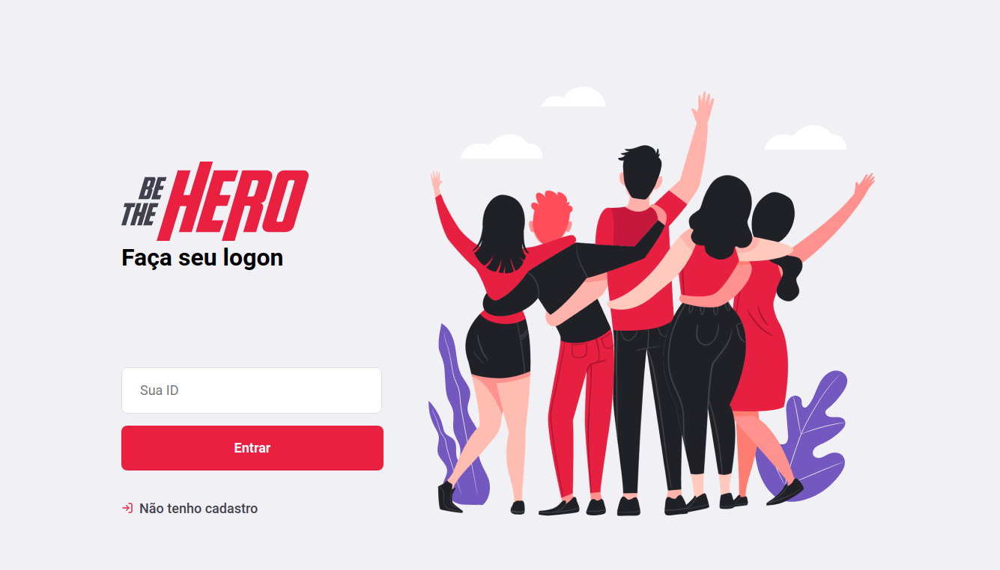
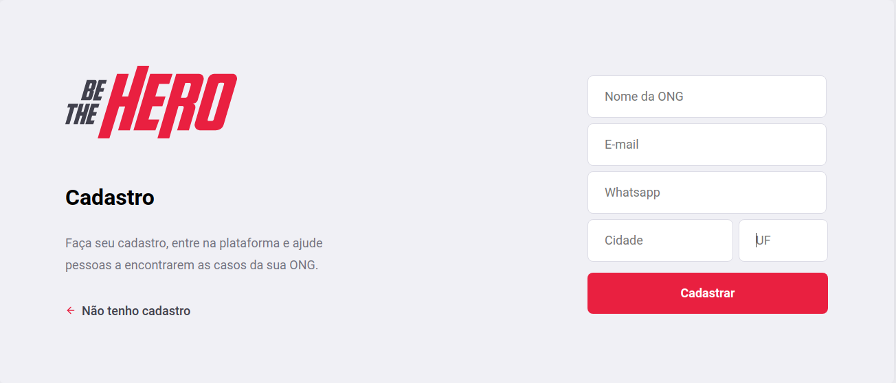
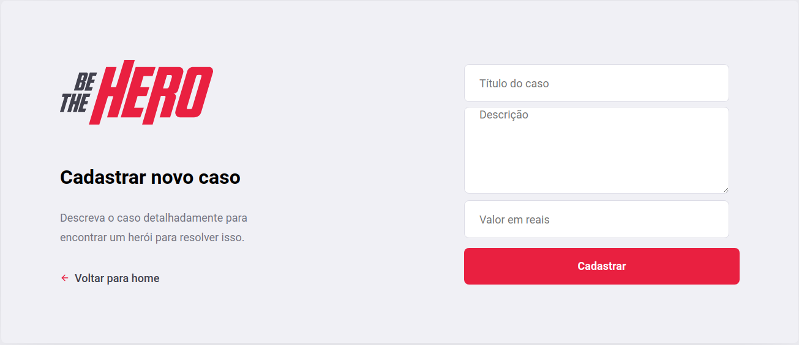
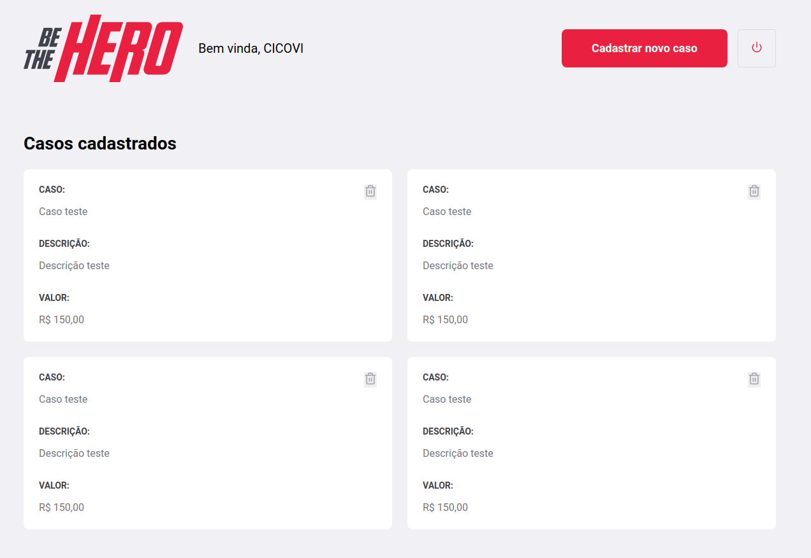

  </img>

> This work is from **OmniStack Week** by [Rocketseat](https://rocketseat.com.br/). With this kind of source, ONGs could get more attention and care from people.

  <!-- 
   -->

  

  
  
  

  <a href="#objective">Objective</a>&nbsp;&nbsp;&nbsp;|&nbsp;&nbsp;&nbsp;
  <a href="#installation">Installation</a>&nbsp;&nbsp;&nbsp;|&nbsp;&nbsp;&nbsp;
  <a href="#run">Run</a>&nbsp;&nbsp;&nbsp;|&nbsp;&nbsp;&nbsp;
  <a href="#login-page">Login page</a>&nbsp;&nbsp;&nbsp;|&nbsp;&nbsp;&nbsp;
  <a href="#new-cases-register">New cases register</a>&nbsp;&nbsp;&nbsp;|&nbsp;&nbsp;&nbsp;
  <a href="#registered-cases">Registered cases</a>&nbsp;&nbsp;&nbsp;|&nbsp;&nbsp;&nbsp;
  <a href="#ongs-registration">Ongs registration</a>&nbsp;&nbsp;&nbsp;|&nbsp;&nbsp;&nbsp;
  <!-- <a href="#license">License</a> -->

## Objective

Build an application that can be used by ONGs to register what they do and their  needs, so people would be able to help.

## Installation

## Run

## Login page

This is where Ongs can login into the application using an ID generated once they've been registered.   

  </img>

## Ongs registration

If it's the organization's first time into this application, it must create a profile in the following page.  

  </img>

## New cases register

Once the ONG is logged in, this web app allows to create new cases - this cases are for the ONG's needs such as volunteers, financial resource, food or anything that could help the Organization get the objective done.   

  </img>

## Registered cases

This area is a list of cases that have been registered. Here the ONG can see what is working progress. 

  </img>

## To do List

- [ ] Mobile version.

- [ ] Features testing.

<!-- - [ ] Documentation, install and run description -->
